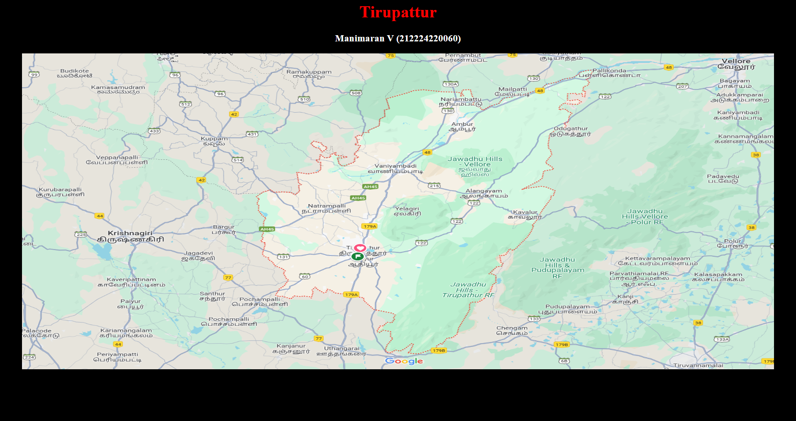

# Ex04 Places Around Me
## Date: 23.04.2025
## Reg.no:212224220060

## AIM
To develop a website to display details about the places around my house.

## DESIGN STEPS

### STEP 1
Create a Django admin interface.

### STEP 2
Download your city map from Google.

### STEP 3
Using ```<map>``` tag name the map.

### STEP 4
Create clickable regions in the image using ```<area>``` tag.

### STEP 5
Write HTML programs for all the regions identified.

### STEP 6
Execute the programs and publish them.

## CODE
```
map.html

<html>
<head>
    <title>My House</title>
</head>
<body bgcolor="black">
    <h1 align="center">
        <font color="red"><b>Tirupattur</b></font>
    </h1>
    <h3 align="center">
        <font color="white"><b>Manimaran V (212224220060)</b></font>
    </h3>
    <center>
        
        <map name="MyCity">
            <area shape="circle" coords="515,549,79" href="home.html" title="My Home" target="_blank">
            <area shape="rect" coords="1034,238,1155,299" href="theatre.html" title="AGS Cinemas" target="_blank">
            <area shape="rect" coords="911,271,1088,306" href="school.html" title="The Schram Academy" target="_blank">
            <area shape="rect" coords="786,48,544,1" href="hospital.html" title="Lalithambigai" target="_blank">
            <area shape="rect" coords="186,198,1,157" href="fishmarket.html" title="Chennai Fish market" target="_blank">
            
        </map>
    </center>
</body>
</html>
```
home.html
```
<html>
<head>
    <title>My Home</title>
</head>
<body bgcolor="darkslateblue">
    <h1 align="center">
        <font color="peachpuff" size="8"><b>My Home</b></font>
    </h1>
    <h3 align="center">
        <font color="lightpink" size="5"><b>birth of the god place</b></font>
    </h3>
    <hr size="3" color="lavender">
    <p align="center">
        <font face="Georgia" size="4" color="white">
            <br> Home is not just a building.It is where the heaven at peace.<br>
            <br> From crazy corners to the scent of familiar food, every part of a home <br>
            <br>carries emotions and memories.It's where we find safety, love, and connection.<br>
            <br> Whether it'stime with family, celebrations,or quiet moments, home holds a special<br>
            <br> place in everyone's life.                                                        <br>
        </font>
    </p>
</body>
</html>
```
hospital.html
```
<html>
<head>
    <title>G.S Hospital</title>
</head>
<body bgcolor="midnightblue"> 
    <h1 align="center">
        <font color="gold" size="8"><b>Hospital</b></font> 
    <h3 align="center">
        <font color="lightcoral" size="5"><b>G.S Hospital - Caring with Excellence</b></font>
    </h3>
    <hr size="3" color="silver">
    <p align="center">
        <font face="Georgia" size="4" color="white">
            <br>G.S Hospital is a trusted name in healthcare, offering world-class medical services<br> 
            <br>in the heart of Tirupattur. Known for its team of skilled professionals and compassionate care,<br> 
            <br>the hospital provides comprehensive treatments ranging from emergency services to specialized<br> 
            <br>surgeries.The hospital is equipped with modern medical technology, ensuring accurate diagnosis<br> 
            <br>and effective treatment.With a patient-first approach, Lalithambigai Hospital strives to create<br>
            <br>a healing environment,blending medical expertise with warmth and empathy.It continues to play a<br> 
            <br>vital role in promoting the well-being of the community.                                       <br>
        </font>
    </p>
</body>
</html>
```
school.html
```
<html>
<head>
    <title>Sri Vijay Vidyalaya</title>
</head>
<body bgcolor="darkslategray">
    <h1 align="center">
        <font color="lightyellow" size="8"><b>School</b></font>
    </h1>
    <h3 align="center">
        <font color="lightskyblue" size="5"><b>Sri Vijay Vidyalaya Matric. Hr. Sec.School</b></font>
    </h3>
    <hr size="3" color="lightsteelblue">
    <p align="center">
        <font face="Georgia" size="4" color="white">
            <br>Sri Vijay Vidyalaya is a renowned international school in Chennai that focuses on holistic education,<br>
            <br>blending academic excellence with extracurricular development. With modern infrastructure,<br> 
            <br>interactive classrooms, and a dedicated faculty, the school ensures that students grow intellectually,<br> 
            <br>emotionally, and socially. Schram is committed to building confident global citizens with strong values, <br>
            <br>creativity, and leadership skills.                                                                       <br>
        </font>
    </p>
</body>
</html>
```
theatre.html
```
<html>
<head>
    <title>AGS Cinemas</title>
</head>
<body bgcolor="#e06377">
    <h1 align="center">
        <font color="cyan"size="8"><b>Theatre</b></font>
    </h1>
    <h3 align="center">
        <font color="lime" size="5"><b>Sri Ramajayam 4K Dolby Atmos Theatre</b></font>
    </h3>
    <hr size="3" color="red">
    <p align="center">
        <font face="Georgia" size="4" color="white">
        <br>Sri Ramajayam Theatre is one of the most popular multiplex chains in Chennai, offering a premium movie<br>
        <br>-watching experience. With state-of-the-art screens, immersive sound systems, and comfortable seating,<br> 
        <br>Sri Ramajayam is a go-to destination for movie lovers. Whether it's the latest blockbusters,regional<br>
        <br>films, or international releases, Sri delivers exceptional entertainment.The cinema halls are well-maintained,<br>
        <br>and the customer service adds to the overall comfort.Sri is committed to bringing high-quality entertainment<br>
        <br>by continuously upgrading its technology and amenities to meet modern audience expectations.               <br>
        </font>
    </p>
</body>
</html>
```

## OUTPUT




## RESULT
The program for implementing image maps using HTML is executed successfully.
